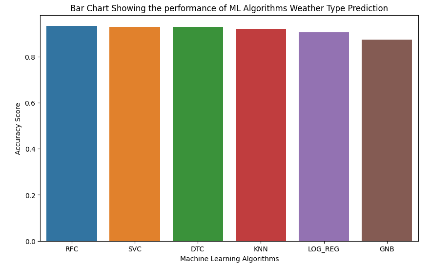

# PERFORMANCE_EVALUATION_OF_MACHINE_LEARNING_ALGORITHMS_FOR_WEATHER_TYPE_PREDICTION

## INTRODUCTION
Identifying categories of weather types such as rainy, cloudy, sunny, and snowy has various personal and public benefits. These benefits extend to several sectors, including: 
-	Transportation: Weather forecasts are beneficial for airlines, shipping, and railways to adjust schedules. This helps ensure safe travel and reduce the number of accidents caused by rain, snow, etc.
- Energy: Sunny weather supports renewable energy production, such as solar energy.
- Agriculture: Farmers can plan planting, irrigation, and harvesting based on weather conditions.

## PROBLEM STATEMENT
Based on some meteorological parameters (feature/independent variables), weather type (target/dependent variable) is to be determined by comparing different machine learning algorithms to determine which performs best. 

## DATA COLLECTION AND PREPROCESSING
1.	Data Collection: The dataset was downloaded from Kaggle. It contains 11 fields (columns) and 13200 observations (rows)
2.	Data Exploration: Exploratory data analysis was performed to understand the datasets.
3.	Data Cleaning: The data consists of outliers detected using the interquartile and a threshold was set to eliminate the outliers.
4. Feature Selection: Of the number of fields present, the fields that were used for predicting weather type include temperature, humidity, wind speed, precipitation, cloud cover, atmospheric     
   pressure, ultraviolet index, season, and visibility.
5. Feature Engineering: The feature/independent categorical variables were transformed into numeric variables using 
  - One Hot Encoding: This was used to transform the feature/independent categorical variables to numeric variables.
  - Label Encoder: This was used to transform the target/dependent variable into numeric, i.e. a multiclass classification.
  - Standard Scaler: This was used to scale the data to a mean of 0 and a  standard deviation of 1.
6. Splitting: The dataset was divided into train and test sets, with 70% and 30% respectively.

## MODEL SELECTION
Since this project is a supervised (classification) learning  machine learning type, the following machine learning classification algorithms are used.
- K Nearest Neighbor
- Logistic Regression
- Support Vector Machine
- Decision Tree Classifier
- Random Forest Classifier
- Naive Bayes

## MODEL EVALUATION
The metrics used to evaluate the performance of the machine learning algorithms include accuracy score, precision, recall, and F1-Score. Also, a confusion matrix was used to visualize both correctly and incorrectly classified observations. 
Accuracy is the simplest error measure in classification, counting (as a percentage) how many of the predictions are correct. It considers whether the machine learning algorithms have guessed the right class.

The models and their respective accuracy score can be found below:
- K Nearest Neighbor (KNN) - 92%
- Logistic Regression (LOG_REG)- 91%
- Support Vector Machine (SVC) - 93%
- Decision Tree Classifier (DTC) - 93%
- Random Forest Classifier (RFC) - 94%
- Naïve Bayes (GNB) – 87%

Below is a bar chart to display the accuracy score. However, other information about other classification metrics can be found in the Jupyter Notebook.

## CONCLUSION AND RECOMMENDATION
In this project, the random forest algorithm performed best. This can be attributed to its operational method, which involves making combined decisions rather than single decisions, as seen in other models.
